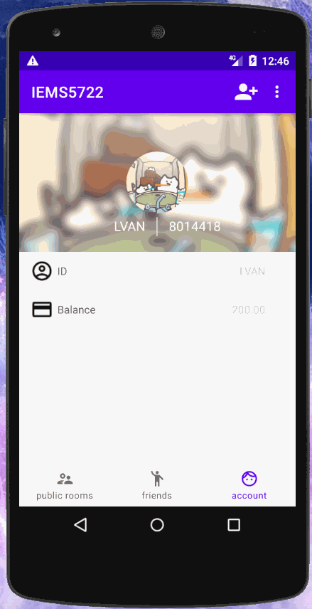

# iems5722
This is an Andriod online chatting application with some basic features. [Demo video](https://mylolis-my.sharepoint.com/:f:/g/personal/b979_365up_site/EjaT-47qNEZAuostPnAXUVkBmkNRZYry8cH0rw7fWVT4PA?e=1EUNiw)

## Log in/out, Sign up (Feature mostly developed by Yifan Zhu, UI mostly developed by Wei Fang)
Once openning the application, you need to create your account with an unique user name, an unique user ID and your password by using the **Sign up** function, then you can log in using your account. The page will be re-directed to a public chatroom list. You can log out when you click the **log out** button in the menu options.

You cannot create an account with a `user ID` or a `user name` that is occupied by other users. And there is a length limit and some format requirements applied in `user ID`, `password`, and `user name`. Hints will be sent out while you do the wrong operation.

## Bottom Navigation (Mostly by Wei Fang)
After users log in successfully, they can choose to enter the public chatrooms (open to all), view friends and their account information through the 3 buttons in the navigation on the bottom. The navigation uses the interface of Material Design.

## Fetch Friends (Mostly by Wei Fang)
After you click the **friends** button on the bottom, the app will return a list view of your friends. If you click one of them, you will enter the one-to-one chatroom for you and the friend you clicked. 

## Fetch Account Information (Mostly by Wei Fang)
If you click the **account** button, you can see a beautiful user interface including information of your ID, username, and balance in your wallet.
use [Glide Interface](https://github.com/bumptech/glide/tree/v3.7.0)

## Red Envelope (Mostly developed by Yifan Zhu)
While you are inside a chatroom, you can send out a red envelope with the total money and number to be set by clicking the top-right **red envelope** button. The money will be reduced in your balance, and you can check out your remaining balance outside the chatroom.

You cannot fetch the same red envelope twice, or send out a red envelope whose total money is larger than your balance. And there is some format requirements applied in the total money and number. Hints will be sent out while you do the wrong operation.

## Add Friend (Mostly by Runze Wang)
After logged in and the user can add friend by 2 methods:
- **Add Friend button**

- **Scan QR Code**

### Add Friend Button
After clicking the **Add Friend button** on Tool bar, a dialog will pop and user can search users by the `User ID`. If the `User ID` searched is existed, a new dialog will pop and display the user infomation, if not, it will show `User Dose Not Exit`. If the `User ID` searched is existed and is not friended with the user, user can click **Add Friend** button to add as friends(Here once the request is sent, the request is accept by default.). If already being friends, the **Add Friend**  will be disable.

### Scan QR Code

The **QR code generation** is based on [QR code generator webAPI](http://goqr.me/api/). 

And **Scan QR Code** function is based on [ZXing library](https://github.com/zxing/zxing).

By scaning the QR Code, the user can add friends as clicking the add friend button.

